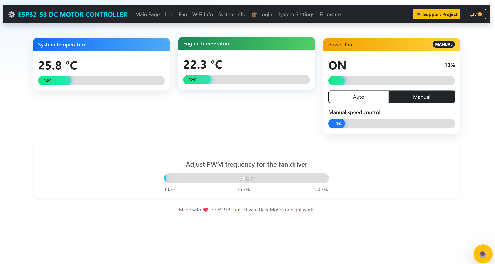

# ⚙️ ESP32-S3 DC MOTOR CONTROLLER


- [⚙️ ESP32-S3 DC MOTOR CONTROLLER](#️-esp32-s3-dc-motor-controller)
    - [🔋 Smart ESP32-S3 DC Motor Controller for Automotive Cooling Fans and DIY Automation](#-smart-esp32-s3-dc-motor-controller-for-automotive-cooling-fans-and-diy-automation)
  - [🌍 Project Overview](#-project-overview)
  - [🧠 Keywords (SEO)](#-keywords-seo)
  - [🖼️ Preview](#️-preview)
- [⚙️ ESP32 DC MOTOR CONTROLLER — Documentation](#️-esp32-dc-motor-controller--documentation)
  - [🔧 Requirements](#-requirements)
  - [🧰 Step 0 — Install Tools](#-step-0--install-tools)
    - [A) GitHub Desktop (Beginner Friendly)](#a-github-desktop-beginner-friendly)
    - [B) Visual Studio Code + PlatformIO](#b-visual-studio-code--platformio)
    - [C) USB Drivers](#c-usb-drivers)
  - [📥 Step 1 — Clone the Repository](#-step-1--clone-the-repository)
    - [Option 1: GitHub Desktop](#option-1-github-desktop)
    - [Option 2: Git CLI](#option-2-git-cli)
  - [⚙️ Step 2 — Open Project in PlatformIO](#️-step-2--open-project-in-platformio)
- [🌍 Environment Variables Setup Guide for PlatformIO](#-environment-variables-setup-guide-for-platformio)
  - [⚙️ Why Use Environment Variables?](#️-why-use-environment-variables)
- [🪟 Windows — 3 Methods](#-windows--3-methods)
  - [1️⃣ Using System Interface (GUI)](#1️⃣-using-system-interface-gui)
  - [2️⃣ Using Command Prompt (CMD)](#2️⃣-using-command-prompt-cmd)
  - [3️⃣ Using PowerShell](#3️⃣-using-powershell)
- [🐧 Linux — 2 Methods](#-linux--2-methods)
  - [1️⃣ Temporary Variables (Session Only)](#1️⃣-temporary-variables-session-only)
  - [2️⃣ Permanent Variables (for all sessions)](#2️⃣-permanent-variables-for-all-sessions)
    - [For **bash**](#for-bash)
  - [🗂️ Step 3 — Upload Web Files (LittleFS)](#️-step-3--upload-web-files-littlefs)
  - [🔌 Step 4 — Connect Your ESP32 Board](#-step-4--connect-your-esp32-board)
  - [🚀 Step 5 — Build and Upload Firmware](#-step-5--build-and-upload-firmware)
  - [🌐 Step 6 — Access the Web Dashboard](#-step-6--access-the-web-dashboard)
  - [⚙️ Step 7 — Manual Fan Control Test](#️-step-7--manual-fan-control-test)
  - [🔁 Firmware Update (OTA)](#-firmware-update-ota)
  - [📡 Network \& Time Management](#-network--time-management)
  - [📶 Wi-Fi Auto Connect \& Network Memory](#-wi-fi-auto-connect--network-memory)
    - [🔹 Features](#-features)
    - [🧠 How It Works](#-how-it-works)
    - [🔧 Example Serial Output](#-example-serial-output)
    - [💾 Persistent Storage](#-persistent-storage)
- [🌐 Web Server \& API Routes Overview](#-web-server--api-routes-overview)
    - [⚙️ Server Initialization](#️-server-initialization)
    - [🔹 Dynamic API Routes](#-dynamic-api-routes)
    - [🗂️ Static Routes (Web UI)](#️-static-routes-web-ui)
    - [🔐 Authentication](#-authentication)
    - [🧠 Error Handling](#-error-handling)
    - [🚀 Server Startup](#-server-startup)
- [⏰ ESP32 Time Synchronization \& NTP Management](#-esp32-time-synchronization--ntp-management)
  - [🧩 Features Overview](#-features-overview)
  - [🧠 Time Sync Priority Flow](#-time-sync-priority-flow)
  - [🕓 Key Functions](#-key-functions)
    - [`bool isDST(struct tm *timeinfo)`](#bool-isdststruct-tm-timeinfo)
    - [`bool tryGetTime(const char *serverName, long gmtOffset, int dstOffset)`](#bool-trygettimeconst-char-servername-long-gmtoffset-int-dstoffset)
    - [`void saveTimeToNVS()`](#void-savetimetonvs)
    - [`bool loadTimeFromNVS(struct tm &timeinfo)`](#bool-loadtimefromnvsstruct-tm-timeinfo)
    - [`void printLocalTime()`](#void-printlocaltime)
    - [`void setupTime()`](#void-setuptime)
  - [🌍 Timezone Configuration](#-timezone-configuration)
  - [💾 Example NVS Keys](#-example-nvs-keys)
  - [🧪 Example Serial Output](#-example-serial-output-1)
  - [⚙️ Integration Notes](#️-integration-notes)
  - [🧯 Troubleshooting](#-troubleshooting)
  - [⚡ Recommended PWM Frequencies](#-recommended-pwm-frequencies)
  - [🧩 Hardware Components Used](#-hardware-components-used)
  - [📸 Example Screenshot](#-example-screenshot)
- [⚙️ System Initialization Overview](#️-system-initialization-overview)
  - [🔧 Initialization Steps (executed in `setup()`)](#-initialization-steps-executed-in-setup)
  - [🌀 Main Loop (`loop()`)](#-main-loop-loop)
  - [📄 License](#-license)
    - [Peaceful Open License (based on MIT License)](#peaceful-open-license-based-on-mit-license)
  - [💖 Support This Project](#-support-this-project)
    - [📁 Project Structure](#-project-structure)
- [🌀 Fan Control \& Sensor Tasks (FreeRTOS)](#-fan-control--sensor-tasks-freertos)
  - [🌡️ `taskSensors()` — Temperature Reading Task](#️-tasksensors--temperature-reading-task)
    - [🔧 Pseudocode Summary](#-pseudocode-summary)
    - [💡 Behavior](#-behavior)
  - [🌀 `taskControl()` — Fan Control Logic](#-taskcontrol--fan-control-logic)
    - [🔧 Key Logic](#-key-logic)
    - [⚙️ Safety \& Stability](#️-safety--stability)
  - [📊 Debug Example (Serial Output)](#-debug-example-serial-output)
  - [🧠 Integration Notes](#-integration-notes)
  - [🧱 Summary](#-summary)
  - [💾 Configuration Storage (LittleFS)](#-configuration-storage-littlefs)
    - [🧠 How It Works](#-how-it-works-1)
    - [🔧 Key Functions](#-key-functions-1)
    - [📁 Example Stored File (`/settings.json`)](#-example-stored-file-settingsjson)
- [PlatformIO build files](#platformio-build-files)
- [Python virtual environment](#python-virtual-environment)
- [System files](#system-files)
- [Temp and backup](#temp-and-backup)
- [Local config](#local-config)
- [Compiled binaries](#compiled-binaries)
  - [👨‍💻 Author](#-author)
  - [💖 Support This Project](#-support-this-project-1)
    - [💡 Suggestions \& Collaboration](#-suggestions--collaboration)

### 🔋 Smart ESP32-S3 DC Motor Controller for Automotive Cooling Fans and DIY Automation


This project is an **open-source ESP32-S3–based DC motor controller** for precise control of **automotive cooling fans** and other **DC-powered systems**.  
It provides advanced **PWM control**, **temperature monitoring**, **CAN bus integration**, and a responsive **web dashboard** over Wi-Fi.


> 💡 Originally built to replace faulty OEM fan controllers in vehicles, this system can also be reused in any DC control project — such as pumps, fans, LEDs, or other DC-based devices.


---

## 🌍 Project Overview

| Feature | Description |
|----------|--------------|
| **MCU** | M5Stack ATOM S3 Lite (ESP32-S3) |
| **Control Type** | PWM via MIC4422 Gate Driver |
| **MOSFET** | IRFP4568 – High-current N-Channel |
| **Diode** | MBR2045 Schottky 45V |
| **Power Stage** | DFR1010 DC-DC Regulator |
| **Sensors** | Dallas DS18B20 + NTC Thermistor |
| **CAN Bus** | CJMCU-1051 or MCP2551 module |
| **Web Interface** | AsyncWebServer + Bootstrap 5 |
| **Storage** | LittleFS for config & OTA updates |
| **UI** | Responsive HTML5 + AJAX + Dark Mode |
| **Firmware Update** | OTA (Web + Filesystem) |
| **Communication** | HTTP / JSON REST API |
| **Logs** | Live system logs  |
| **Safety** | Overheat protection + manual override |

---

## 🧠 Keywords (SEO)

ESP32 DC Motor Controller, ESP32 Fan Controller, Automotive Cooling ESP32, Smart Fan Control ESP32S3,  
ESP32 PWM Controller, ESP32 Web Dashboard, Dallas DS18B20 ESP32, NTC Thermistor, CAN bus CJMCU,  
IRFP4568 MOSFET Driver, MIC4422 ESP32 PWM, ESP32S3 Automotive Cooling System, LittleFS ESP32 Web UI.

---

## 🖼️ Preview



---

# ⚙️ ESP32 DC MOTOR CONTROLLER — Documentation

This documentation explains how to **set up, build, and use** the ESP32 DC Motor Controller project based on the **M5Stack Atom S3 Lite** (ESP32-S3).  
It includes complete installation steps, from cloning the repository to launching the web dashboard.

---

## 🔧 Requirements

| Component | Version / Details |
|------------|------------------|
| **PlatformIO** | Core 6.1.15+ |
| **Framework** | Arduino-ESP32 3.0.0+ |
| **Board** | `m5stack-atom-s3-lite` |
| **USB Driver** | CP210x / CH34x (if required) |
| **Libraries** | Automatically installed via `platformio.ini` |

---

## 🧰 Step 0 — Install Tools

### A) GitHub Desktop (Beginner Friendly)
1. Download and install **GitHub Desktop** from [https://desktop.github.com](https://desktop.github.com).
2. Log in or create a GitHub account.
3. Make sure you also have **Visual Studio Code** installed.

### B) Visual Studio Code + PlatformIO
1. Install **Visual Studio Code** from [https://code.visualstudio.com](https://code.visualstudio.com).
2. Go to **Extensions → PlatformIO IDE** and install PlatformIO.
3. PlatformIO will automatically install all toolchains for ESP32.

### C) USB Drivers
If your board is not detected:
- Install the driver **CP210x** or **CH34x** (depending on the USB-UART chip).
- Restart your PC and reconnect the board using a **USB-C data cable**.
- For Linux users: install PlatformIO’s *udev rules* (use command “Install PlatformIO Core udev rules”).

---

## 📥 Step 1 — Clone the Repository

### Option 1: GitHub Desktop
1. Open **GitHub Desktop → File → Clone Repository → URL**  
2. Paste the repository link:
   ```
   https://github.com/devbmv/ESP32-DC-MOTOR-CONTROLLER.git
   ```
3. Choose the destination folder and click **Clone**.
4. Click **Open in Visual Studio Code**.

### Option 2: Git CLI
```bash
git clone https://github.com/devbmv/ESP32-DC-MOTOR-CONTROLLER.git
cd ESP32-DC-MOTOR-CONTROLLER
code .
```

---

## ⚙️ Step 2 — Open Project in PlatformIO

1. When VS Code opens, PlatformIO automatically detects the project.
2. It will download the ESP32 toolchain and required libraries.
3. Example of `platformio.ini` (for Atom S3 Lite board):

```ini
[env:atom_s3]
platform = espressif32
board = m5stack-atoms3
framework = arduino
monitor_speed = 115200
upload_speed = 1500000
board_build.filesystem = littlefs
board_build.partitions = partitions_8MB.csv
board_upload.flash_size = 8MB
extra_scripts = pre:gzip_files.py, build_firmware_version.py
build_type = debug
debug_tool = esp-builtin
debug_init_break = tbreak setup
debug_extra_cmds = set index-cache off
build_unflags = -std=gnu++11

build_flags = 
	-D ARDUINO_USB_CDC_ON_BOOT=1
	-I include/
	-I src/
	-std=gnu++17
	-DWIFI_SSID=\"${sysenv.WIFI_SSID}\"
	-DWIFI_PASSWORD=\"${sysenv.WIFI_PASSWORD}\"
	-Dcar_user_name=\"${sysenv.car_user_name}\"
	-Dcar_user_password=\"${sysenv.car_user_password}\"
	-DDJANGO_USERNAME=\"${sysenv.DJANGO_API_USERNAME}\"
	-DDJANGO_PASSWORD=\"${sysenv.DJANGO_API_PASSWORD}\"
	-DMBEDTLS_CONFIG_FILE='"mbedtls/esp_config.h"'
	-D LOG_LEVEL=1
	-D CONFIG_ESP_COREDUMP_ENABLE_TO_FLASH=1
	-D CONFIG_ESP_COREDUMP_DATA_FORMAT_ELF=1
	
lib_deps = 
	ESP Async WebServer @ ^1.2.3
	https://github.com/me-no-dev/AsyncTCP.git
	FastLED
	adafruit/Adafruit NeoPixel@^1.15.1
	paulstoffregen/OneWire@^2.3.8
	milesburton/DallasTemperature@^4.0.4
	bblanchon/ArduinoJson@^7.4.2
	arkhipenko/TaskScheduler@^3.8.5
```

> **Tip:** If you serve HTML files from flash memory, ensure you have the `/data` folder for LittleFS.

---

# 🌍 Environment Variables Setup Guide for PlatformIO

This guide explains how to configure **environment variables** for your ESP32-S3 project, both on **Windows** and **Linux**.  
These variables store sensitive data (like Wi-Fi credentials or API keys) so that they don’t appear directly in your source code.

---

## ⚙️ Why Use Environment Variables?

Environment variables allow you to:
- Protect sensitive information (Wi-Fi passwords, usernames, API tokens)
- Keep your `project_config.h` and `platformio.ini` clean
- Reuse the same project on multiple systems safely

Example in your `platformio.ini`:
```ini
build_flags =
    -DWIFI_SSID=\"${sysenv.WIFI_SSID}\"
    -DWIFI_PASSWORD=\"${sysenv.WIFI_PASSWORD}\"
    -Dcar_user_name=\"${sysenv.car_user_name}\"
    -Dcar_user_password=\"${sysenv.car_user_password}\"
    -DDJANGO_USERNAME=\"${sysenv.DJANGO_API_USERNAME}\"
    -DDJANGO_PASSWORD=\"${sysenv.DJANGO_API_PASSWORD}\"
```

These variables (`WIFI_SSID`, `WIFI_PASSWORD`, etc.) must be defined in your system environment.

---

# 🪟 Windows — 3 Methods

## 1️⃣ Using System Interface (GUI)

1. Press **Win + R**, type `sysdm.cpl`, and press **Enter**.  
2. Go to the **Advanced** tab → click **Environment Variables**.  
3. Under **User variables**, click **New…**
4. Add each variable name and value, for example:
   - Name: `WIFI_SSID`
   - Value: `put here your Wifi Name`
   - Name: `WIFI_PASSWORD`
   - Value: `put here your wifi password`
5. Click **OK** → restart **VS Code**.

✅ Done — PlatformIO will now detect them automatically.

---

## 2️⃣ Using Command Prompt (CMD)

```cmd
setx WIFI_SSID "HomeNetwork"
setx WIFI_PASSWORD "MySecurePass123"
setx car_user_name "admin"
setx car_user_password "1234"
setx DJANGO_API_USERNAME "esp_user"
setx DJANGO_API_PASSWORD "esp_pass"
```

Then **restart your computer or VS Code** for changes to take effect.

To verify:
```cmd
echo %WIFI_SSID%
```

---

## 3️⃣ Using PowerShell

```powershell
[System.Environment]::SetEnvironmentVariable('WIFI_SSID', 'HomeNetwork', 'User')
[System.Environment]::SetEnvironmentVariable('WIFI_PASSWORD', 'MySecurePass123', 'User')
[System.Environment]::SetEnvironmentVariable('car_user_name', 'admin', 'User')
[System.Environment]::SetEnvironmentVariable('car_user_password', '1234', 'User')
[System.Environment]::SetEnvironmentVariable('DJANGO_API_USERNAME', 'esp_user', 'User')
[System.Environment]::SetEnvironmentVariable('DJANGO_API_PASSWORD', 'esp_pass', 'User')
```

Check:
```powershell
echo $env:WIFI_SSID
```

---

# 🐧 Linux — 2 Methods

## 1️⃣ Temporary Variables (Session Only)

Open a terminal and type:
```bash
export WIFI_SSID="HomeNetwork"
export WIFI_PASSWORD="MySecurePass123"
export car_user_name="admin"
export car_user_password="1234"
export DJANGO_API_USERNAME="esp_user"
export DJANGO_API_PASSWORD="esp_pass"
```

These will last until you close the terminal.

To verify:
```bash
echo $WIFI_SSID
```

---

## 2️⃣ Permanent Variables (for all sessions)

Add them to your shell configuration file:

### For **bash**
Edit the file:
```bash
nano ~/.bashrc
```
Add this block at the bottom:
```bash
export WIFI_SSID="HomeNetwork"
export WIFI_PASSWORD="MySecurePass123"
export car_user_name="admin"
export car_user_password="1234"
export DJANGO_API_USERNAME="esp_user"
export DJANGO_API_PASSWORD="esp_pass"
```

Save and reload:
```bash
source ~/.bashrc
```


## 🗂️ Step 3 — Upload Web Files (LittleFS)

If your project serves web UI from internal flash:
1. In VS Code:
   ```
   PlatformIO → Project Tasks → Upload Filesystem Image
   ```

This will upload all files into the ESP32’s LittleFS partition.

---

## 🔌 Step 4 — Connect Your ESP32 Board

1. Plug the **M5Stack Atom S3 Lite** (or ESP32-S3 Dev Board) into your computer.
2. If flashing fails with “Failed to connect”:
   - Hold the **BOOT** button for 2–3 seconds while clicking **Upload** if connection fails.

   - Retry the upload .

---

## 🚀 Step 5 — Build and Upload Firmware

| Action | PlatformIO Task |
|--------|-----------------|
| **Build Firmware** | *Project Tasks → Build* |
| **Upload Firmware** | *Project Tasks → Upload* |
| **Upload Filesystem** | *Project Tasks → Upload Filesystem Image* |
| **Open Serial Monitor** | *Project Tasks → Monitor* |

---

## 🌐 Step 6 — Access the Web Dashboard

After flashing:
1. Open the **Serial Monitor** → The ESP32 will print the IP address (example: `192.168.1.50`).
2. Open a web browser and visit:
   ```
   http://your-ip
   ```
3. You will see the control dashboard with:
   - Real-time **system and engine temperatures**
   - **Fan control** (Manual / Auto)
   - **PWM Frequency Control** slider
   - **Mode switch** and **progress bars**

---

## ⚙️ Step 7 — Manual Fan Control Test

1. Select **Manual Mode**
2. Adjust the **Manual Speed** slider or progress bar
3. Confirm motor response (gradual change)
4. Test PWM frequency using `/set_pwm_freq` or the frequency card

---


## 🔁 Firmware Update (OTA)

1. Go to `/firmware_update`
2. Select your `.bin` firmware file generated by PlatformIO
3. Click **Upload**
4. Wait for the upload to complete
5. The ESP32 will **restart automatically**

---


---

## 📡 Network & Time Management

This controller automatically manages both **Wi-Fi connections** and **system time**.

- 🧠 **Wi-Fi Auto-Reconnect**  
  The device stores multiple Wi-Fi credentials in NVS and always tries the most recent successful one first.  
  If none work, it cycles through all known networks and finally tries the default credentials from `project_config.h`.

- ⏰ **Time Synchronization (NTP + DST)**  
  Automatically synchronizes with local router or public NTP (`pool.ntp.org`), detecting Irish **Daylight Saving Time** (GMT/BST).  
  When offline, it falls back to the **last saved timestamp** stored in NVS.

- 💾 **Persistent Storage**  
  Both Wi-Fi and time data are stored in non-volatile memory and survive power loss or firmware updates.

## 📶 Wi-Fi Auto Connect & Network Memory

The controller includes a **smart Wi-Fi connection manager** that automatically connects to the most recently successful or known networks.

### 🔹 Features
- Automatically loads all saved Wi-Fi credentials from non-volatile memory (NVS)
- Attempts to reconnect to the **last successful network** first
- If that fails, cycles through all saved networks until one connects
- Stores each successful connection for faster reconnection next time
- Falls back to **default credentials** from `project_config.h` if no saved network works
- Allows multiple Wi-Fi credentials to be stored and updated automatically

### 🧠 How It Works
1. On startup, the ESP32 loads all previously saved Wi-Fi credentials from NVS.  
2. It first attempts to connect to the last known working network.  
3. If unsuccessful, it iterates through all saved networks sequentially.  
4. When a successful connection is established, it saves that SSID and password as the latest working one.  
5. If no connection can be made, it will try the default credentials defined in the firmware.  

### 🔧 Example Serial Output

```
📡 Initializing Wi-Fi...
⭐ Trying last successful network: Home_Network
✅ Connected to Home_Network
📶 IP: 192.168.1.42
```

If no saved network works:

```
📡 Initializing Wi-Fi...
❌ No saved Wi-Fi networks available or reachable.
📶 Trying default credentials...
⚠️ Could not connect to any network!
```

### 💾 Persistent Storage
All networks are stored under the **`wifi_networks`** namespace in **NVS**, with each SSID and password saved as a unique entry.

| Key Example | Description |
|--------------|-------------|
| `ssid0`, `pass0` | First saved Wi-Fi network |
| `ssid1`, `pass1` | Second saved network |
| `last_ssid`, `last_pass` | Last successful connection |

---


# 🌐 Web Server & API Routes Overview

The firmware includes a fully asynchronous **ESPAsyncWebServer** implementation,  
providing both static web pages and dynamic RESTful API endpoints for real-time control.

---

### ⚙️ Server Initialization

The main web server is initialized inside the `initServer()` function.  
It dynamically registers **more than 25 routes**, including system APIs, OTA update endpoints,  
filesystem management, and static UI pages served from **LittleFS**.

---

### 🔹 Dynamic API Routes

| Route | Method | Description |
|--------|---------|-------------|
| `/api/settings` | GET / POST | Retrieve or update system configuration in JSON format |
| `/api/sensors` | GET | Returns real-time temperature and PWM data |
| `/api/settings/defaults` | GET | Restores default system configuration |
| `/cmd` | POST | Execute a command via Serial Console passthrough |
| `/set_pwm_freq` | POST | Change PWM frequency on-the-fly |
| `/set_manual_percent` | POST | Adjust manual fan percentage (0–100%) |
| `/send_sms` | POST | Sends a WhatsApp message using CallMeBot API |
| `/firmware_update` | POST | Upload new firmware (.bin) via OTA |
| `/updatefs` | POST | Upload and replace web UI filesystem (LittleFS OTA) |
| `/deleteFile` | POST | Delete a specific file from LittleFS |
| `/format_fs` | POST | Format LittleFS partition |
| `/files_list` | GET | Returns a JSON list of all files in LittleFS |
| `/fs_status` | GET | Shows LittleFS storage usage and free space |
| `/meminfo` | GET | Reports heap, PSRAM, and flash memory statistics |
| `/sysinfo` | GET | Returns firmware, uptime, and system information |
| `/wifi_info` | GET | Shows Wi-Fi network details and IP address |
| `/restart` | GET | Restarts the device |
| `/log` | GET | Returns runtime logs |
| `/clear_log` | GET | Clears log buffer |
| `/ota_status` | GET | Checks current OTA update state |
| `/log_function_execution` | GET | Displays execution times for core functions |
| `/toggle_fan` | GET | Toggles fan state |
| `/set_mode` | GET | Switches between AUTO or MANUAL control |
| `/alarma` | GET | Triggers or tests audible alarm |
| `/status` | GET | Returns full JSON system status |

> 🧩 Each endpoint is handled asynchronously to ensure non-blocking operation even during heavy web traffic.

---

### 🗂️ Static Routes (Web UI)

The web interface pages are stored inside **LittleFS** (`/data` folder) and automatically served by the web server.

| URL | File | Type |
|------|------|------|
| `/` | `index.html` | Main dashboard |
| `/dashboard` | `dashboard.html` | Fan and sensor control page |
| `/log_page` | `log.html` | Live log viewer |
| `/firmware_update` | `firmware_update.html` | OTA firmware upload interface |
| `/wifi` | `wifi_info.html` | Wi-Fi info and diagnostics |
| `/about` | `about.html` | About / project info |
| `/contact` | `contact.html` | Contact page |
| `/servicii` | `servicii.html` | Services / description |
| `/despre` | `despre.html` | Romanian "About" page |
| `/navbar` | `navbar.html` | Shared navigation bar fragment |
| `/style.css` | `style.css` | Global CSS |
| `/script.js` | `script.js` | JavaScript logic |
| `/bootstrap.min.css` | `bootstrap.min.css` | Bootstrap CSS |
| `/bootstrap.bundle.min.js` | `bootstrap.bundle.min.js` | Bootstrap JS |
| `/alert.mp3`, `/alarm.wav` | Audio alert sounds |

All static content is served with caching headers:  
`Cache-Control: max-age=86400` (1 day).

---

### 🔐 Authentication

Basic cookie-based authentication is supported using the header:
```
Cookie: ESPSESSION=123456
```
You can extend this for secure login in your custom HTML pages.

---

### 🧠 Error Handling

If an unknown route is accessed, the server responds with:
```
404 - Not found
```

All errors are logged via the system logger (`LOGI`, `LOGE`) and visible both in Serial Monitor and `/log_page`.

---

### 🚀 Server Startup

At the end of `initServer()`, all routes are attached and the web server is started:

```cpp
server.begin();
LOGI("[HTTP] Web server started successfully");
```

Once started, the ESP32 can be accessed from a browser at:
```
http://<device-ip>/
```

---

> 🧭 This modular route system ensures scalability — you can add new API endpoints simply by adding them to the `urlpatterns` or `staticroutes` vectors inside `initServer()`.

---


# ⏰ ESP32 Time Synchronization & NTP Management

This module handles **time synchronization**, **Daylight Saving Time (DST)** detection, and **persistent time storage** for offline recovery.  
It ensures the ESP32 always maintains accurate time — even after restarts or when disconnected from the internet.

---

## 🧩 Features Overview

| Feature | Description |
|----------|-------------|
| 🌐 **NTP Sync** | Automatically synchronizes time with public or local NTP servers |
| 🕓 **DST Detection** | Detects and adjusts for Daylight Saving Time in Ireland |
| 💾 **NVS Storage** | Saves last known time in NVS for recovery after reboot |
| 🔁 **Fallback Logic** | Tries router → public NTP → stored time |
| 🧭 **Debug Output** | Prints full date and time in Serial Monitor |

---

## 🧠 Time Sync Priority Flow

1. **Try local router (gateway) as NTP server**  
   → If successful, save and display the time.

2. **Try public NTP pool (`pool.ntp.org`)**  
   → Detects if DST is active in Ireland (`GMT0BST,M3.5.0/1,M10.5.0/2`)  
   → Applies appropriate UTC offset (+0 or +1h).

3. **Fallback: Load last saved time from NVS**  
   → If both attempts fail, use stored values for hour/date.

---

## 🕓 Key Functions

### `bool isDST(struct tm *timeinfo)`
Determines whether the current date falls within **Daylight Saving Time (DST)** in Ireland.

### `bool tryGetTime(const char *serverName, long gmtOffset, int dstOffset)`
Attempts to synchronize the ESP32’s clock with the given **NTP server**.

### `void saveTimeToNVS()`
Stores the **current time** in NVS for later use if the network becomes unavailable.

### `bool loadTimeFromNVS(struct tm &timeinfo)`
Loads the **last saved time** from NVS and restores it on startup if needed.

### `void printLocalTime()`
Prints the current local time to Serial in a readable format.

### `void setupTime()`
Main function that performs the full time synchronization sequence:
```
1️⃣ Try router NTP
2️⃣ Try public NTP
3️⃣ Use last saved time
```

---

## 🌍 Timezone Configuration

Ireland’s timezone (with DST support) is handled using:
```cpp
const char *TZ_IRELAND = "GMT0BST,M3.5.0/1,M10.5.0/2";
configTzTime(TZ_IRELAND, "pool.ntp.org");
```
This automatically adjusts between **GMT** and **BST (British Summer Time)**.

---

## 💾 Example NVS Keys

| Key | Description |
|------|-------------|
| `year` | Saved year |
| `month` | Saved month |
| `day` | Saved day |
| `hour` | Saved hour |
| `minute` | Saved minute |
| `second` | Saved second |

---

## 🧪 Example Serial Output

```
⏳ Attempting full time sync...
🌐 Trying router NTP at 192.168.1.1
✅ Time synchronized from router
💾 Time saved to NVS.
🕒 Current time: 22:15:04  05/10/2025
🇮🇪 DST active: Yes (+1h)
```

---

## ⚙️ Integration Notes

- Ensure **Wi-Fi is connected** before calling `setupTime()`.
- Call it **once in setup()** to initialize clock.
- Optionally, re-sync every 24 hours using `TaskScheduler` or a timer.

---


## 🧯 Troubleshooting

| Problem | Solution |
|----------|-----------|
| **ESP32 not detected** | Install CP210x/CH34x drivers. Use a data-capable USB-C cable. |
| **Upload failed** | Hold BOOT during upload, or press RESET once. |
| **No IP in serial monitor** | Ensure Wi-Fi credentials are correct and DHCP is enabled. |
| **Web page doesn’t load** | Check if both PC and ESP32 are on the same network. Try IP instead of `.local`. |
| **Missing UI files** | Re-upload filesystem image (LittleFS). Verify routes in server code. |

---

## ⚡ Recommended PWM Frequencies

| Application | PWM Frequency |
|--------------|---------------|
| **Automotive DC Fan** | 25–30 kHz |
| **General DC Motor** | 20–50 kHz |
| **Low-speed PWM** | 1–10 kHz |
| **High-efficiency driver** | 60–80 kHz |

---

## 🧩 Hardware Components Used

| Part | Description |
|------|-------------|
| **M5Stack Atom S3 Lite (ESP32-S3)** | Main microcontroller |
| **AUIRFP4568** | MOSFET for high-current DC control |
| **MIC4422YN** | MOSFET gate driver |
| **MBR2045CST** | Schottky diode for reverse protection |
| **DFR1010-ND (DC-DC)** | Voltage regulator module |
| **Dallas DS18B20** | Digital temperature sensor |
| **NTC Thermistor** | Analog temperature sensor |
| **CJMCU-1051 CAN Module** | Optional automotive CAN bus interface |

---

## 📸 Example Screenshot


---


# ⚙️ System Initialization Overview

The firmware is designed for **modular initialization**, meaning each subsystem (Wi-Fi, sensors, tasks, etc.) is initialized independently during the `setup()` phase.  
This ensures clean boot sequences, error isolation, and easy debugging.

## 🔧 Initialization Steps (executed in `setup()`)

1. **System Boot & UART**
   - Initializes serial communication (`initUart()`).
   - Registers all serial console commands (`initCommands()`).

2. **Time Synchronization**
   - Synchronizes the internal RTC via NTP or stored values (`setupTime()`).

3. **Hardware Setup**
   - Initializes **pins**, **ADC**, **DallasTemperature**, **RGB LED**, and **CAN (TWAI)**.
   - Configures **PWM channels** and **fan control pins**.

4. **Filesystem & Configuration**
   - Mounts **LittleFS**, loads JSON configuration, and applies runtime settings.
   - Handles **core dump cleanup** and OTA partition info.

5. **Networking**
   - Attempts Wi-Fi connection using stored credentials or defaults.
   - Displays SSID, IP, and RSSI info in the serial console.

6. **Multitasking**
   - Creates **FreeRTOS queues, mutexes, and event groups**.
   - Spawns the main tasks:
     - `taskSensors()` → Reads temperature sensors.
     - `taskControl()` → Controls fan logic.
     - `taskCan()` → Monitors CAN bus messages.

7. **Web Server**
   - Starts the **asynchronous HTTP server** (`initServer()`).
   - Registers REST API endpoints (`/api/sensors`, `/api/settings`, etc.).
   - Serves HTML/JS files directly from **LittleFS**.

8. **Heartbeat Timer**
   - Toggles an LED every 500 ms to indicate system activity.

## 🌀 Main Loop (`loop()`)

The main loop simply:
- Monitors **serial commands** via USB.
- Yields to the RTOS scheduler (`vTaskDelay(50ms)`).

> ⚡ The heavy lifting is done in the **background FreeRTOS tasks**, not in the main loop — ensuring non-blocking, stable operation.


## 📄 License

### Peaceful Open License (based on MIT License)
> This license is a modified ethical version of the MIT License, allowing use only for peaceful and non-commercial purposes.

Copyright (c) 2025 Mihail Barbascumpa (devbmv)

Permission is hereby granted, free of charge, to any person obtaining a copy
of this software and associated documentation files (the “Software”), to use,
copy, modify, merge, and distribute copies of the Software for **non-commercial
and peaceful purposes only**, subject to the following conditions:

1. The above copyright notice and this permission notice shall be included in
   all copies or substantial portions of the Software.

2. The Software shall **not** be used, modified, or distributed for:
   - Military, surveillance, or weapon development;
   - Harmful, exploitative, or unethical activities;
   - Commercial use, resale, or monetization without the author's explicit written consent.

3. Any redistribution or modification must provide **clear attribution**
   to the original author: *Mihail Barbascumpa (devbmv)* and include
   a link to the official GitHub repository:
   [https://github.com/devbmv/ESP32-DC-MOTOR-CONTROLLER](https://github.com/devbmv/ESP32-DC-MOTOR-CONTROLLER).

THE SOFTWARE IS PROVIDED “AS IS”, WITHOUT WARRANTY OF ANY KIND, EXPRESS OR IMPLIED,
INCLUDING BUT NOT LIMITED TO THE WARRANTIES OF MERCHANTABILITY, FITNESS FOR A
PARTICULAR PURPOSE, AND NON-INFRINGEMENT. IN NO EVENT SHALL THE AUTHORS OR COPYRIGHT
HOLDERS BE LIABLE FOR ANY CLAIM, DAMAGES, OR OTHER LIABILITY, WHETHER IN AN ACTION OF
CONTRACT, TORT, OR OTHERWISE, ARISING FROM, OUT OF, OR IN CONNECTION WITH THE SOFTWARE
OR THE USE OR OTHER DEALINGS IN THE SOFTWARE.

---

## 💖 Support This Project

If you find this project useful, consider supporting development:

- ☕ [Buy Me a Coffee](https://buymeacoffee.com/devbmv)
- 💳 [Donate via Revolut](https://revolut.me/mihailuf6d)

---


### 📁 Project Structure

```
ESP32-DC-MOTOR-CONTROLLER/
│
├── .pio/ # PlatformIO build cache
├── .venv/ # Python virtual environment
├── .vscode/ # VSCode settings and extensions
│
├── boards/ # Board definitions (if used)
├── data/ # LittleFS web files (served to browser)
│ ├── index.html
│ ├── style.css
│ └── global.js
│
├── include/ # Header files (.h)
├── lib/ # Custom or external libraries
│
├── screenshots/ # UI screenshots and previews
│ └── main_page.png
│
├── src/ # Main source files (.cpp)
│ ├── main.cpp
│ ├── build_number.cpp
│ ├── loadSettings.cpp
│ ├── log.cpp
│ ├── NVS.cpp
│ ├── project_config.cpp
│ ├── rgb.cpp
│ ├── rtc_time.cpp
│ ├── saveSettings.cpp
│ ├── tasks.cpp
│ ├── time.cpp
│ ├── urls.cpp
│ ├── utils.cpp
│ ├── view.cpp
│ └── WiFi_Network.cpp
│
├── templates/ # Optional templates for web or HTML generation
├── test/ # Unit tests
│ └── test.cpp
│
├── build_firmware_version.py # Script for firmware versioning
├── gzip_files.py # Script to compress files for LittleFS
│
├── partitions_4MB.csv # Partition table for 4MB flash
├── partitions_8MB.csv # Partition table for 8MB flash
├── partitions_16MB.csv # Partition table for 16MB flash
│
├── platformio.ini # PlatformIO environment configuration
├── LICENSE # Project license (MIT)
├── README.md # Project documentation (this file)
└── .gitignore # Git ignore rules
```

---


# 🌀 Fan Control & Sensor Tasks (FreeRTOS)

This module defines two core FreeRTOS tasks responsible for **temperature acquisition** and **fan speed control** on the ESP32-S3.  
It ensures real-time, non-blocking operation of the cooling system.

---

## 🌡️ `taskSensors()` — Temperature Reading Task

This task continuously reads the **engine** and **system temperatures** from:
- A **Dallas DS18B20** digital sensor (`engineC`)
- An **NTC thermistor** (`systemC`)

It runs every **10 ms**, updating the global `sensorDataQueue` with the latest readings.

### 🔧 Pseudocode Summary
```cpp
void taskSensors(void *) {
    for (;;) {
        read_engine_temp();   // Dallas DS18B20
        read_system_temp();   // Analog NTC
        xQueueOverwrite(sensorDataQueue, &sensorData);
        vTaskDelay(pdMS_TO_TICKS(10));  // 10ms cycle
    }
}
```

### 💡 Behavior
- Keeps temperature readings up-to-date.
- Ensures other tasks (like control or web server) always access the latest data.
- Uses **FreeRTOS queues** for thread-safe communication.

---

## 🌀 `taskControl()` — Fan Control Logic

This is the **core control loop** that determines and applies the PWM output for the fan.

It runs every **20 ms**, reading the latest sensor data and updating the PWM duty cycle depending on:
- **AUTO mode** — automatic fan speed based on temperature.
- **MANUAL mode** — user-defined speed via web dashboard.

### 🔧 Key Logic
```cpp
if (s.systemC > g_settings.system_temp_alert) {
    // Safety cutoff
    sensorData.targetPercent = 0;
    sensorData.target_pwm = 0;
}
else if (g_settings.fan_mode == FanMode::AUTO) {
    // Linear mapping between min/max rotation temps
    float ratio = (s.engineC - g_settings.min_rotation_temp) /
                  (g_settings.max_rotation_temp - g_settings.min_rotation_temp);
    ratio = constrain(ratio, 0.0f, 1.0f);
    sensorData.targetPercent = round(ratio * 100.0f);
    sensorData.target_pwm = round(ratio * pwm_max());
}
else {
    // Manual control
    sensorData.targetPercent = g_settings.manual_on ? g_settings.manual_percent : 0;
    sensorData.target_pwm = (sensorData.targetPercent / 100.0f) * pwm_max();
}

ledcWrite(g_settings.pwm_channel, sensorData.target_pwm);
```

### ⚙️ Safety & Stability
- Automatic shutdown when temperature exceeds `system_temp_alert`.
- Linear temperature-to-speed mapping for **smooth transitions**.
- Manual mode always overrides auto when explicitly enabled.
- Non-blocking timing using `millis()` and `vTaskDelay()`.

---

## 📊 Debug Example (Serial Output)
```
[FAN] mode=AUTO pct=62 pwm=2538/4095
[FAN] mode=AUTO pct=70 pwm=2866/4095
[FAN] mode=MANUAL pct=45 pwm=1842/4095
```

---

## 🧠 Integration Notes
- Both tasks are **pinned to specific cores** for deterministic timing (set elsewhere in setup).
- Designed for **real-time responsiveness** without blocking.
- Works seamlessly with the web API and JSON configuration stored in LittleFS.

---

## 🧱 Summary
| Task | Purpose | Interval | Dependencies |
|------|----------|-----------|--------------|
| `taskSensors` | Read sensors | 10 ms | DS18B20, NTC |
| `taskControl` | Control fan PWM | 20 ms | `sensorDataQueue`, PWM driver |

---

📁 **Recommended placement in documentation:**  
Add this section right **after "⚡ Features and Control"** or as a dedicated chapter called  
> `## 🌀 Fan Control & Sensor Tasks (FreeRTOS)`


## 💾 Configuration Storage (LittleFS)

The controller saves all user and system configuration parameters in **LittleFS** for persistence across reboots and firmware updates.

### 🧠 How It Works
- Configuration data is stored as a structured JSON file in LittleFS.
- Before writing, the firmware compares the current and previous configurations to avoid unnecessary flash writes.
- On boot, the ESP32 automatically loads all settings from this JSON file into memory.

### 🔧 Key Functions
| Function | Description |
|-----------|-------------|
| `fillJsonFrom()` | Converts the `SystemSettings` structure to JSON format for storage. |
| `settingsSaveToFS()` | Saves the current configuration to LittleFS in a human-readable JSON file. |
| `settingsLoadFromFS()` *(elsewhere in code)* | Loads and parses settings from flash at startup. |

### 📁 Example Stored File (`/settings.json`)
```json
{
  "hostname": "esp32-dcmotor",
  "fan_mode": "AUTO",
  "manual_percent": 30,
  "pwm_freq_hz": 25000,
  "system_temp_alert": 90,
  "wifi_ssid": "MyHomeNetwork"
}


# ⚡ Features and Control

### 🌡 Temperature Monitoring
- Reads **System** and **Engine** temperatures via DS18B20 and NTC sensors.
- Displays them live on the web dashboard.
- Adjustable alert threshold (default **90°C**).

### 🌬️ Fan Control
- **AUTO mode:** adjusts fan speed proportionally to temperature.
- **MANUAL mode:** allows direct control of fan speed from the web UI.
- PWM frequency adjustable between **1 kHz and 150 kHz**.
- Safety logic ensures fan remains on if temperature > threshold.

### 🔌 Hardware CAN Bus *(future feature)*
- Designed for reading automotive ECU data via **CJMCU** or **MCP2551**.
- Integrates with `ESP32 TWAI` driver (for next updates).

### 🌍 Web Dashboard
- Responsive interface built with **Bootstrap 5**.
- Includes **dark/light mode**, **progress bars**, and **real-time updates**.
- All data loaded via `fetch()` + JSON API.

### 💾 LittleFS Storage
- Stores system settings, Wi-Fi credentials, and OTA updates.
- Serves static files: `/index.html`, `/style.css`, `/global.js ...`.

### 🧱 OTA Update
- Upload new firmware or filesystem directly from `/firmware_update`.

### 🔔 Logs & Debug
- `/log_page` – runtime logs, heap usage, and uptime.
- `/api/sensors` and `/api/settings` – JSON endpoints for live data.

---


---

## 🧩 Firmware Functionalities Overview

This section describes the **internal modules and commands** available inside the firmware.  
They can be accessed either from the **Serial Console** or automatically by the system.

---

### 🧭 Serial Console Commands

The controller provides an **interactive Serial Console** for debugging and runtime control.  
You can access it using **PlatformIO → Monitor** or any serial terminal at **115200 baud**.

#### 🔹 Available Commands

| Command | Description |
|----------|-------------|
| `help` | Shows all available commands |
| `status` | Displays live temperature, PWM, and target values |
| `get <var>` | Reads variables like `systemC`, `engineC`, or `hostname` |
| `set <var> <val>` | Sets runtime variables (e.g., `set manual_percent 80`) |
| `fan_mode auto/manual` | Switches fan mode between automatic or manual |
| `set_pwm <value>` | Sets manual PWM duty directly (0–255 or according to resolution) |
| `heap` | Displays current free heap memory |
| `time` | Prints the current local time (from NTP or NVS) |
| `uptime` | Displays how long the device has been running |
| `clear_log` | Clears runtime logs in memory |
| `restart` | Restarts the ESP32 |
| `send_sms "<message>"` | Sends a WhatsApp message via **CallMeBot API** |
| `wifi_set <ssid> <password>` | Connects to a Wi-Fi network and saves it in NVS |
| `wifi_clear` | Erases all stored Wi-Fi credentials |

> 🧠 Example usage in Serial Monitor:
> ```
> > fan_mode manual
> > set_pwm 120
> > status
> ```

---

### ⚙️ System Initialization Modules

The firmware initializes the following subsystems at boot:

| Function | Description |
|-----------|-------------|
| `initUart()` | Initializes Serial communication at 115200 baud |
| `initDallas()` | Initializes the Dallas DS18B20 temperature sensor |
| `initFs()` | Mounts **LittleFS** filesystem and formats if corrupted |
| `initPins()` | Configures GPIOs for temperature sensors and fan control |
| `initADC()` | Sets up analog-to-digital conversion for NTC sensors |
| `reinitPwm()` | Configures LEDC PWM channel dynamically |

---

### 🌡 Temperature Reading

| Function | Description |
|-----------|-------------|
| `read_system_temp()` | Reads analog NTC sensor and converts to Celsius using B-parameter formula |
| `read_engine_temp()` | Reads DS18B20 digital sensor and handles disconnect detection |
| `applyManualFan(on, percent)` | Calculates PWM output and drives the fan proportionally |

---

### 🕹 Fan Control and PWM

- PWM frequency and resolution can be changed dynamically.
- Fan speed is controlled in **AUTO** or **MANUAL** mode.
- The function `pwm_max()` ensures consistent scaling for all bit-depths.

---

### 📡 CAN (TWAI) Bus Integration

| Function | Description |
|-----------|-------------|
| `canInit(bitRate)` | Initializes the TWAI (CAN) bus with selectable baud rate (250k, 500k, 1M) |
| `taskCan()` | Background FreeRTOS task that logs incoming CAN frames in HEX, DEC, and BIN |
| `twai_message_t` | Uses native ESP-IDF CAN driver for maximum compatibility |

---

### 💾 Core Dump and Diagnostics

| Function | Description |
|-----------|-------------|
| `clearCoreDumpOnce()` | Clears core dump memory on first boot after crash |
| `logSystemInfo()` | Prints memory usage, heap, IRAM/DRAM stats, and CPU info |

---

### 💡 LED Status

| Function | Description |
|-----------|-------------|
| `setLed(r, g, b)` | Sets onboard RGB LED color using **FastLED** |

LED colors are used to indicate status:
- 🟢 Normal operation  
- 🔵 Wi-Fi connecting  
- 🔴 Error or overheating  

---

### 🔁 Timed Execution

`setInterval(intervalMs, fn)` —  
A custom non-blocking scheduler for calling functions at timed intervals without using `delay()`.

---

### ☎️ CallMeBot WhatsApp Integration

| Function | Description |
|-----------|-------------|
| `sendSMS(message)` | Sends a message to your WhatsApp using CallMeBot API |
| API Example | `https://api.callmebot.com/whatsapp.php?phone=+353858440006&text=Hello&apikey=9861441` |

---

### 🔐 Authentication (Web Sessions)

`isAuthenticated()` checks for valid cookies (`ESPSESSION=123456`) to protect web pages.  
This can be extended for secure login in the web dashboard.

---

### 🧠 Utilities

| Helper | Description |
|----------|-------------|
| `formatUptime()` | Converts milliseconds to readable format (1d 2h 30m) |
| `urlencode()` | Encodes text for safe HTTP transmission |
| `processCommand()` | Parses and executes serial commands dynamically |

---

> 🧩 These internal functions make the firmware modular, debuggable, and easy to extend  
> with new hardware modules such as CAN frames, temperature profiles, or remote control APIs.

---


## 🧰 Example API Endpoints

| Endpoint | Description |
|-----------|-------------|
| `/api/sensors` | Returns JSON with temperature and system data |
| `/api/settings` | Returns or updates stored configuration |
| `/firmware_update` | Web page for OTA firmware upload |
| `/log_page` | Displays real-time logs |
| `/` | Main control interface |

---

## 🧱 .gitignore Example

Make sure you have this `.gitignore` file in your root folder:

```
# PlatformIO build files
.pio/
.pioenvs/
.piolibdeps/
.vscode/.browse.c_cpp.db*
.vscode/c_cpp_properties.json
.vscode/launch.json
.vscode/ipch/

# Python virtual environment
.venv/
env/
venv/
__pycache__/
*.pyc
*.pyo

# System files
.DS_Store
Thumbs.db

# Temp and backup
*.log
*.tmp
*.bak

# Local config
config.local.json
secrets.json

# Compiled binaries
*.bin
*.elf
*.map
```

---

## 👨‍💻 Author

**Mihail Barbascumpa (devbmv)**  
📧 [maik775@yahoo.com](mailto:maik775@yahoo.com)  
🌍 [github.com/devbmv](https://github.com/devbmv)

🛡️ This project and its documentation are protected under the **MIT License**.  
Unauthorized **commercial redistribution or rebranding without credit** is **strictly prohibited**.  
For contributions, please **fork** the repository and submit a **pull request**.

---

## 💖 Support This Project

> Donations are voluntary and go entirely toward supporting open-source development — they do not constitute a commercial transaction.

If you find this project useful, consider supporting further development:

- ☕ [Buy Me a Coffee](https://buymeacoffee.com/devbmv)
- 💳 [Donate via Revolut](https://revolut.me/mihailuf6d)

📘 Full documentation and technical details are available in the **README.md** and `/docs` folder.

---

### 💡 Suggestions & Collaboration

I’m always open to **suggestions, improvements, or collaboration ideas** related to this project.  
If you have feedback, feature requests, or wish to contribute, feel free to contact me directly at  
📩 **[maik775@yahoo.com](mailto:maik775@yahoo.com)**  

> 🙌 Together, we can make this controller smarter, more efficient, and useful for the entire DIY and automotive community.
